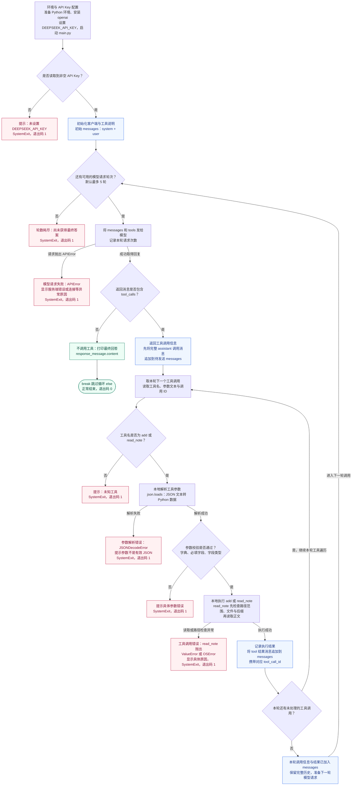

# Simple Agent：项目总结

更新日期：2026-09-13。流程依据：[当前 main.py](../main.py)。本篇用作项目介绍入口，文末提供三分钟口述参考稿，可在练习后改成自己的表达。

## 1. 项目做什么

通过 Python 和 DeepSeek API 实现工具调用闭环：模型根据问题提出调用请求，本地程序校验并执行工具，将结果交给模型继续处理。目前有两个工具：`add` 计算两数之和，`read_note` 读取项目 `notes/` 目录内的 Markdown 正文。

## 2. 完整流程图

环境与 API Key 配置是运行前的准备。运行时程序先检查密钥，随后从初始消息开始请求模型；每一轮可能直接回答，也可能提出一个或多个工具调用。

### 读图时要注意的对应关系

- **两个循环：**内层逐个处理同一条模型回复中的工具调用；外层再次请求模型。内层处理全部完成后才重新发送消息。
- **追加与发送分开：**调用消息先追加一次，每完成一个工具再追加它的结果。追加只改变本地列表，下一轮执行请求语句时才发送给模型。
- **错误不是普通回答：**例如无效密钥导致 API 服务返回 401，SDK 抛出异常；图中将它归入“模型请求失败”。如果模型在普通正文中说“出错了”，但没有 `tool_calls`，当前程序仍会打印正文并正常结束。
- **轮数判断是流程抽象：**代码实际使用 `for i in range(5)`；自然耗尽进入循环的 `else`。最后允许的一轮直接回答时会 `break`，不会误报次数耗尽；若这一轮仍调用工具，则先执行工具，再因没有下一轮而退出。
- **异常范围与代码一致：**参数错误、未知工具以及 `read_note` 的 `ValueError` / `OSError` 有明确退出处理。当前没有包住所有本地执行或回复结构错误的通用异常处理，图中的工具错误出口不表示任意异常都已被捕获。

## 3. 演示与笔记入口

| 想说明什么 | 对应材料 |
| --- | --- |
| 依赖、配置、启动和示例输入 | [README](../README.md) |
| 成功、认证失败、次数耗尽及其退出状态 | [当天演示索引](request-errors.md#demo-index) |
| 工具调用信息的结构与参数解析 | [Tool Calling](tool-calling.md) |
| 消息历史、多个工具与多轮请求 | [Agent Loop](agent-loop.md) |
| 文件读取、路径检查和文件异常 | [read_note](read-note.md) |
| 请求异常、退出状态码和复习纠错 | [9/13 复盘](request-errors.md) |

## 4. 我的三分钟口述

以下是根据当前实现和第一次录音整理的参考稿，不是录音的逐字转写。以三分钟左右为练习目标，实际时长需要朗读计时。小标题用于记住顺序，口述时不用读出。

### 项目需求与用途

我用 Python 和 DeepSeek API 做了一个最小 Agent，主要用来学习模型怎样通过本地工具完成任务。模型负责提出调用请求，本地程序负责执行。我在指导下自己完成了代码，目前支持两个工具：计算两数之和，以及读取本地 Markdown 笔记，让模型根据正文进行总结。

### 两个工具与完整消息流程

程序先读取 API 密钥，创建客户端，再把用户问题和工具说明发送给模型。

如果模型要求调用工具，程序就取出工具名、调用编号和参数，解析 JSON，并检查参数是否合法。检查通过后，本地执行工具，得到计算结果或笔记正文。

接着，程序把模型的调用请求和工具执行结果追加到消息历史，在下一轮一起发送给模型。结果中保留对应的调用编号，因此同一个工具调用多次，也能区分每个结果属于哪次请求。

例如，读取笔记时，第一轮模型提出读取请求，本地读取并保存结果，第二轮模型收到正文后再生成总结。如果一轮请求了多个工具，程序会依次执行，全部处理完再请求模型。

### 如何停止及处理错误

我设置了最多五轮模型请求，生成最终回答也占一轮。模型不再调用工具时，程序打印回答并结束；次数耗尽还没得到回答，就提示任务未完成并退出。

对于参数错误、文件读取失败和模型请求异常，程序也有对应的提示和退出处理。我实际验证了正常读取笔记时退出码为零，无效密钥和次数耗尽时退出码为一。

### 我解决过的一个技术问题

我遇到过一个路径处理问题：把 resolve 方法直接写在字符串后面，导致调用了字符串不存在的方法。后来用括号让程序先拼接出 Path 对象，再解析路径，解决了问题。

此外，路径拼接不保证文件仍在笔记目录内，所以程序还会检查解析后的目标路径，拒绝读取目录外的文件。

### 当前限制与收获

目前，用户问题还写在源码里，消息历史也只保存在本次运行中。工具失败后程序会退出，还没有把错误交给模型尝试修正。

这个项目让我理解了 Agent 的基本闭环：模型提出请求，程序校验并执行工具，再把结果交回模型，直到生成回答或触发停止条件。
